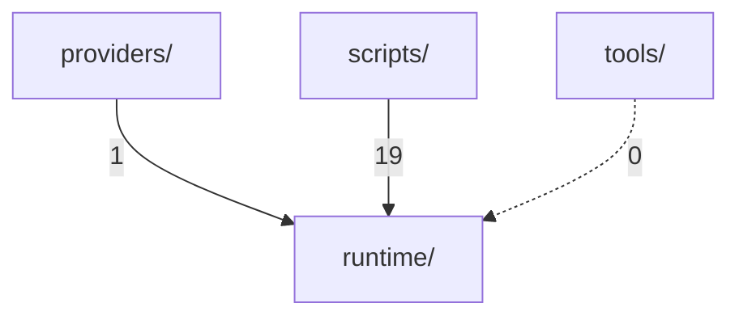

# RFO static analysis — agent-native readiness

- ts: `20260508T012512Z`
- skill version: `19.3` (runtime_contract `19.3`, failure_corpus_index `19.2.1`)
- branch: `feat/v19-3-sync-from-canonical` (off `feat/v19-2-0-runtime-truth` @ `a1bc11e`)
- snapshot of pre-sync worktree: `wip/snapshot-pre-sync-20260508T012512Z` (commit `6ba4165`)
- canonical source: `/opt/openclaw/data/workspace/skills/research-factory-orchestrator/`
- working tree: `_projects/aiSKILLS/research-factory-orchestrator/research-factory-orchestrator/`
- nothing pushed (per plan)

## TL;DR

The skill is **architecturally sound** (Phase 5: zero layer leaks, zero cycles in `runtime/`, `tools/agent_telegram/` decoupled, `providers/cli` only depends on `runtime.capability`). The agent-native problem is **content**, not **wiring**: backend names (Telegram especially, plus search engines) are baked into runtime fields/env-flags, into 3 contracts at the data layer, and into 2 monolithic scripts (`run_rfo_with_web_search.py`, `run_rfo_full_research.py`).

| dimension | status |
|---|---|
| import layer policy (no `runtime/`→below) | ✅ pass |
| import cycles in `runtime/` | ✅ none |
| `runtime/` HTTP egress isolated | ⚠️ 1 site (`collector.py` urlopen) |
| backend-name leak in `runtime/` code | ❌ 4 files |
| backend-name leak in `contracts/` JSON | ❌ 3 files |
| backend-name leak in `scripts/` (hot path) | ❌ 2 monolithic scripts + 5 smokes |
| backend-name leak in `policies/`, `playbooks/`, `validation-profiles/`, `schemas/` | ✅ clean |
| security HIGH (bandit) | ⚠️ 3 SHA-1 in scripts |
| dead imports / dead vars | ⚠️ 4 imports / 10 vars |
| cyclomatic hot spots | ⚠️ 3 rank-F funcs in `runtime/` |
| skill self-validators | ⚠️ 4 real findings, 3 false-positive on `.venv/` |

## Phases at a glance

| # | phase | report | key result |
|--:|---|---|---|
| Pre | sync from canonical | `00-sync-from-canonical.md` | 24 files / 729 add / 450 del; deleted `providers/telegram/`, 2 telegram smokes |
| 0 | tooling | `01-tooling.md` | venv at `.venv/`; ruff 0.15.12, pyflakes 3.4.0, bandit 1.9.4, vulture 2.16, radon 6.0.1 |
| 1 | self-validators | `02-self-validators.md` | 6 PASS / 6 FAIL / 1 SKIP; 4 real findings + 3 `.venv/` false positives |
| 2 | hardcode hunt | `03-hardcode-hunt.md` | runtime: 4 files leak Telegram vocab; scripts: 2 monoliths leak SearXNG/Wikipedia |
| 3 | contract neutrality | `04-contracts-neutrality.md` | 3 contracts/JSON name "telegram"; policies/playbooks/profiles/schemas clean |
| 4 | code hygiene | `05-hygiene.md` | ruff 1207 (mostly compact-style noise), bandit 154 (3 HIGH SHA-1), CC=128 hot spot |
| 5 | import graph | `06-import-graph.md` | 320 files, 86 edges, 0 leaks, 0 cycles |

---

## Top-N findings (priority list)

Ranked by impact on agent-native correctness × runtime-path proximity × ease of acting on it.

### P0 — runtime/ leaks Telegram-specific vocabulary

Affects: agent-native principle directly. `runtime/` is the layer that must not know about specific backends.

| file | line | what |
|---|--:|---|
| `runtime/cli.py` | 29 | comment about `chat_id` MUST come from incoming update |
| `runtime/adapter_impl.py` | 27 | `"chat_id": _opt(getattr(a, "chat_id", ""))` |
| `runtime/artifact_execute_impl.py` | 24 | `"chat_id": None` field |
| `runtime/compatibility-matrix.json` | 15 | `upgrade_notes` mention `TELEGRAM_API_BASE`, `Telegram real sendMessage` |
| `runtime/worker_impl.py` | 85 | `os.environ.get("RFO_ALLOW_ENV_CHAT_ID")` — env name leaks Telegram |

Action options (architecture decision required, not a code fix per se):

- **(a) rename to neutral** in delivery vocabulary (`recipient_id` / `target_id` / `delivery.recipient`); `RFO_ALLOW_ENV_CHAT_ID` → `RFO_ALLOW_ENV_RECIPIENT`.
- **(b) declare `chat_id` is the delivery-vocabulary canonical name and Telegram-likeness is coincidence** — possible but weakens the principle and keeps `TELEGRAM_*` notes in `compatibility-matrix.json`.

Either way, `compatibility-matrix.json:15` (operational notes) and `worker_impl.py:85` (env-name) are unambiguous candidates for renaming because they emit Telegram terminology with no neutral equivalent.

### P1 — contracts/ JSON hardcodes "telegram"

Affects: agent-native at the contract / data layer. These files are the contract surface that callers and validators read.

| file | line | what |
|---|--:|---|
| `contracts/delivery-contract.json` | 7 | key `"telegram"` carrying chat formatting rules (`plain_text_only`, `no_tables`, `no_local_paths`, `no_raw_sensitive_contacts`) |
| `contracts/provider-capabilities.json` | 12 | `"telegram"` listed alongside transport roles `cli`, `webhook`, `direct_runtime` |
| `contracts/interface-adapter-contract.json` | 5,10 | `"telegram"` in both `supported_interfaces` and `supported_providers` |
| `contracts/golden-reference.md` | n/a | references missing `contracts/telegram-golden/` and `--provider telegram --interface telegram` |

Action: rename the `delivery-contract.json` key to something role-shaped (`chat_text_plain` or move to a separate `delivery-formatting-profiles.json` keyed by role); reduce `provider-capabilities.json` and `interface-adapter-contract.json` to roles only and keep backend-name knowledge inside `providers/<name>/capabilities.json` or via a separate registry. `golden-reference.md` either gets a neutral example or moves under `examples/`.

### P2 — `scripts/run_rfo_with_web_search.py` and `scripts/run_rfo_full_research.py`

Two scripts in `scripts/` (the hot-path `scripts/`, since some scripts re-enter via `runtime.cli`) hardcode a full SearXNG + Wikipedia + Google + Bing pipeline:

- `scripts/run_rfo_with_web_search.py:51` `_SEARCH_ENDPOINT = os.environ.get("RFO_SEARXNG_URL", "http://searxng:8080")`
- `scripts/run_rfo_with_web_search.py:86` direct call to `https://en.wikipedia.org/w/api.php?...`
- `scripts/run_rfo_full_research.py:35` `_SEARXNG = os.environ.get("RFO_SEARXNG_URL", "http://searxng:8080")`
- `scripts/run_rfo_full_research.py:306` `"backend": "searxng"` literal in manifest output
- `scripts/run_rfo_full_research.py:343` `"SearXNG web search (Google, Bing, Wikipedia engines)"` methodology string

These violate "agent decides which search backend to use". They were also pre-flagged in Pre-Phase as a known import from canonical.

Action: move under `examples/`, or replace with a strictly-parametric runner that requires the agent to pass `--search-backend-url`/manifests, or delete entirely.

Phase-4 confirms these scripts also drag `B310` (urllib audit) and dead-import warnings.

### P3 — Telegram-specific smoke tests + adapter inside `scripts/`

| file | issue |
|---|---|
| `scripts/_smoke_v19_2_1_honesty.py` | `TELEGRAM_BOT_TOKEN`, `TELEGRAM_CHAT_ID`, `RFO_ALLOW_ENV_CHAT_ID` |
| `scripts/_smoke_v19_2_1_repro_after_fix.py` | same |
| `scripts/interface_runtime_adapter.py` | `--chat-id`, `--api-base` defaults `https://api.telegram.org` |
| `scripts/_rfo_path_guard.py` | example block with `TELEGRAM_API_BASE` |
| `scripts/_diff_telegram_against_golden.py` | filename-named diff utility |
| `scripts/verify_openclaw_run.py` | docstring describes silent-stub path with `chat_id` |

These reach `runtime` via `runtime.cli`/`runtime.legacy_compat`, so they are part of the runtime-adjacent surface. Action: split into `tools/agent_telegram/` (operator-side, already exists) or delete. They are smoke tests and operator scaffolding, not skill code that must remain in `scripts/`.

### P4 — `runtime/collector.py` is the only HTTP egress in runtime

`runtime/collector.py:67` invokes `urllib.request.urlopen` (bandit `B310/MEDIUM`). It is reached when `RFO_EXTERNAL_COLLECTION` is enabled. With `RFO_NO_NETWORK` and `RFO_HTTP_TIMEOUT` flags around it the egress is gated, but the audit calls for:

- explicit scheme allow-list (block `file://` and custom schemes);
- enforced socket timeout (we already read `RFO_HTTP_TIMEOUT`, but collector should fail closed);
- hard cap on `RFO_MAX_EXTERNAL_SOURCES` per call;
- consider replacing with `urllib3` (timeout-friendly) or making collector pluggable so the agent can supply the egress function.

### P5 — `runtime.outbox_impl.cmd_outbox` is the cyclomatic hot spot

`runtime/outbox_impl.py:51 cmd_outbox` — CC=128, rank `F`. By far the worst block in the codebase. Combined with bandit findings on the same module (4× `B603` subprocess, 2× `B110` silent except), this is a single function controlling the outbox lifecycle. Maintainability `MI=21.3` (rank-A but bottom of band).

Other rank-F runtime spots: `runtime/validate_impl.py:86 validate` CC=63, `runtime/failure_impl.py:14 cmd_failure` CC=43.

Action: refactor candidates after the agent-native cleanup; not blocking.

### P6 — bandit HIGH severity (3 SHA-1)

`scripts/init_runtime.py:119`, `scripts/interface_common.py:11`, `scripts/match_io_methods.py:13` — all `hashlib.sha1(...)`. Either pass `usedforsecurity=False` if non-crypto, or migrate to BLAKE2 / SHA-256.

### P7 — silent except-pass in runtime/

5 sites:

```
runtime/error_log.py:34
runtime/util.py:19
runtime/outbox_impl.py:185
runtime/outbox_impl.py:413
runtime/worker_impl.py:298
runtime/worker_impl.py:443
runtime/schema_defaults.py:138
```

Review each one — logging-only swallows are acceptable, but truly silent ones can hide misroutes.

### P8 — runtime contract drift (skill self-validator)

`scripts/validate_runtime_contract_current.py` returns:

```json
{ "status": "fail", "code": "F340",
  "message": "current runtime contract does not list init_runtime outputs" }
```

Real architectural inconsistency: the runtime emits `init_runtime` outputs, but the contract on disk does not enumerate them.

### P9 — skill discovery frontmatter version mismatch

`validate_skill_discovery_frontmatter` expects `version=18.3.2-…` but the skill body is v19.3. Either the validator (an 18.3.2 hotfix) is stale or the frontmatter rule needs updating.

### P10 — dead imports / vars / functions (advisory)

- ruff F401 / pyflakes "imported but unused": 4 in `runtime/`, ~95 in `scripts/`.
- ruff F841 / pyflakes "local var unused": 10 in `scripts/` (e.g. `_smoke_v19_2_1_honesty.py:101,307`).
- vulture 60% confidence: 16 dead-looking exports in `runtime/` (need cross-check against contract registries before removing — likely false positives because static AST cannot see JSON-driven dispatch).

These are advisory cleanup candidates.

---

## Layer / wiring health (Phase 5 detail)



- 320 .py scanned, 86 in-skill edges.
- `providers/cli/cli_delivery_adapter.py` -> `runtime.capability` (single edge from providers).
- 14 unique `scripts/*.py` import `runtime.*`; 5 of them re-enter through `runtime.cli` (good — reuse, not duplication).
- `tools/agent_telegram/` does **not** import `runtime/` — fully decoupled.
- 0 cycles within `runtime/`.

`runtime/` hubs by fan-out: `worker_impl` (13), `cli` (7), `impl` (7). By fan-in: `util` (13), `status` (6), `worker_impl` (5).

## Doc-only backend-name surface (informational)

Not blocking, but recorded for the cleanup conversation:

| file / dir | hits | category |
|---|--:|---|
| `SKILL.md` | 32 (Tg) + 1 (Slack) + 1 (Discord) | docs |
| `SKILL-core.md` | 1 | docs |
| `AGENTS.md` | 6 | operator instructions |
| `CHANGELOG.md` | 2 | history |
| `docs/` | 60 | ADR-014/016, release notes |
| `examples/` | 61 | `examples/v15-sample-run/telegram/`, `examples/report-delivery/telegram/` |
| `failure-corpus/` | 22 | failure cases |
| `references/telegram-*-policy.md` | 6 files | named policy docs |
| `templates/telegram/*.txt` | 7 files | named templates |

These do not affect runtime; they violate the agent-native intent in naming only and can be addressed later as a documentation pass.

## Scope reminders (what this report does NOT do)

Per the plan:

- No code edits (no `runtime/`, `scripts/`, `contracts/` changes).
- No RFO runs, no gateway rebuild, no Telegram delivery.
- `/opt/openclaw-openrouter` and `mm27` untouched.
- No push (commits stay local, `feat/v19-3-sync-from-canonical` is local).
- No new validators authored.
- No refactor proposal authored beyond the priority list above.

## Artifacts laid down

```
_projects/aiSKILLS/research-factory-orchestrator/reports/static-analysis/20260508T012512Z/
├── 00-summary.md                       # this file
├── 00-sync-from-canonical.md           # Pre-Phase
├── 00-rsync-{dry-run,actual}.log
├── 00-git-{diff-stat,status}.txt
├── 00-commit-info.txt
├── 01-tooling.md
├── 01-tooling-pip-freeze.txt
├── 02-self-validators.md
├── 02-self-validators-summary.tsv
├── 02-self-validators/                 # raw stdouts of each validator
├── 03-hardcode-hunt.md
├── 03-hardcode-hunt/                   # rg + AST raw output
├── 03-ast-runtime-scan.py              # AST-scanner driver
├── 04-contracts-neutrality.md
├── 04-contracts-neutrality/            # rg per bucket
├── 05-hygiene.md
├── 05-hygiene/                         # ruff/pyflakes/bandit/vulture/radon raw
├── 06-import-graph.md
├── 06-import-graph.py                  # graph builder
└── 06-import-graph/
    ├── import-graph.json               # full edge list
    ├── layer-graph.mmd                 # cross-layer mermaid
    ├── runtime-graph.mmd               # internal runtime graph
    └── _summary.txt
```

## Open questions for owner review

These were already in the plan, leaving them visible here so the report is self-contained:

1. P0 vocabulary call: is `chat_id` the canonical neutral term in delivery vocabulary, or do we rename to `recipient_id` / `target_id` (and rename `RFO_ALLOW_ENV_CHAT_ID` → `RFO_ALLOW_ENV_RECIPIENT`)? Affects `runtime/{cli,adapter_impl,artifact_execute_impl,worker_impl}.py` and `runtime/compatibility-matrix.json`.
2. P1 contract surgery: split `delivery-contract.json` formatting rules from backend names; reduce `provider-capabilities.json` / `interface-adapter-contract.json` to neutral roles. Big surface but straightforward edits.
3. P2 search-pipeline scripts: delete `scripts/run_rfo_with_web_search.py` and `scripts/run_rfo_full_research.py`, move them under `examples/`, or convert to fully parametric agent-driven runners?
4. P3 Telegram smokes: delete from `scripts/` or move under `tools/agent_telegram/`?
5. P4 collector hardening: fix in place (scheme allow-list + timeout + cap) or make collector pluggable so agents can supply the egress function?
6. P5–P10 are advisory; defer to a refactor / cleanup plan after P0–P4 are decided.
