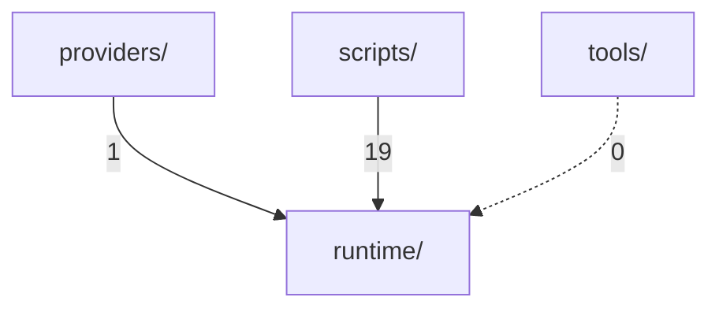
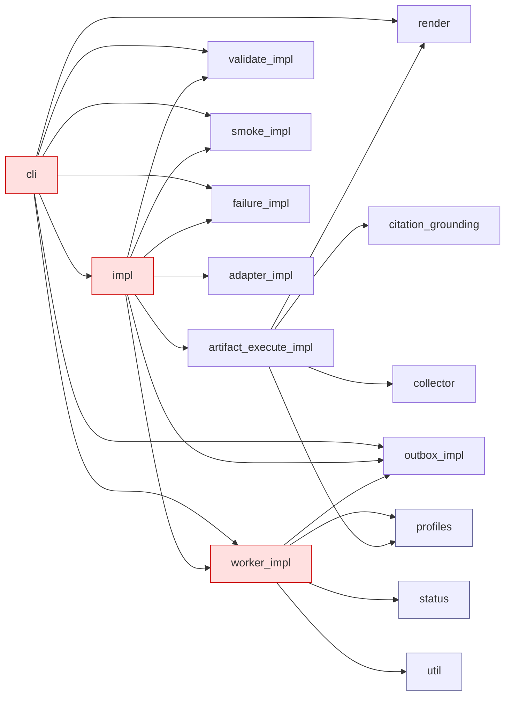

# Phase 5 — Import graph & layer leaks

- ts: `20260508T012512Z`
- targets: `runtime/`, `scripts/`, `providers/`, `tools/`
- script: `06-import-graph.py`
- artifacts: `06-import-graph/{import-graph.json,layer-graph.mmd,runtime-graph.mmd,_summary.txt}`

## Headline

| metric | value |
|---|---:|
| Python files scanned | 320 |
| In-skill import edges | 86 |
| Cross-layer edges (runtime layer leak) | **0** |
| Cycles inside `runtime/` | **0** |

**Layer policy holds.** The `runtime/` package is at the top of the import stack — nothing inside `runtime/*` imports from `providers/`, `scripts/`, or `tools/`. There are also no import cycles within `runtime/`. This is one of the strongest agent-native signals in the codebase.

## 5.1 Layer summary

```
providers -> runtime   1 edge
runtime   -> runtime  66 edges (internal)
scripts   -> runtime  19 edges
tools     -> runtime   0 edges
```

Mermaid (`06-import-graph/layer-graph.mmd`):



`tools/agent_telegram/` (operator-side stack with its own `requirements.txt`, nginx config, systemd unit, and webhook server) is fully decoupled from `runtime/` and from the rest of the skill. It is a self-contained operator artifact — confirmed by AST scan: no Python file under `tools/` imports `runtime.*`.

## 5.2 `providers/` → `runtime/`

Single edge: `providers/cli/cli_delivery_adapter.py:9 -> runtime.capability`.

Interpretation: the CLI provider depends only on `runtime.capability` (the capability ticket / token-file abstraction). It does **not** depend on outbox / worker / validate impls — i.e. the provider does not bypass runtime contracts and does not couple into runtime internals. Healthy.

`providers/webhook/` was scanned (the Phase 3 directory listing showed `providers/webhook/`); it produces no Python imports into `runtime/` (likely a thin shim or template-only directory).

## 5.3 `scripts/` → `runtime/`

19 edges, 14 unique scripts. Full mapping:

| script | imports |
|---|---|
| `_smoke_subagent_isolation.py` | `runtime.validate_impl` |
| `_validator_sdk.py` | `runtime.validator_sdk` |
| `build_research_package.py` | `runtime.worker_impl` |
| `interface_runtime_adapter.py` | `runtime.cli` |
| `outbox_delivery_worker.py` | `runtime.cli` |
| `render_full_html_report.py` | `runtime.legacy_compat` |
| `rfo_runtime_core.py` | `runtime.cli` |
| `rfo_v18_core.py` | `runtime.cli` |
| `run_rfo_full_research.py` | `runtime.util` |
| `run_rfo_with_web_search.py` | `runtime.render`, `runtime.util` |
| `runtime_job_worker.py` | `runtime.cli` |
| `validate_chat_claims_against_delivery_manifest.py` | `runtime.legacy_compat` |
| `validate_gate_consistency.py` | `runtime.legacy_compat` |
| `validate_release_report.py` | `runtime.status` |

Observations:

- The shape is healthy: scripts are **clients** of runtime, never the other way around.
- 5 scripts (`interface_runtime_adapter.py`, `outbox_delivery_worker.py`, `rfo_runtime_core.py`, `rfo_v18_core.py`, `runtime_job_worker.py`) all enter through `runtime.cli` — i.e. they reuse the CLI dispatcher rather than reimplementing it. Good.
- `legacy_compat.py` is consumed by 3 scripts (a render and two validators). Confirms that `runtime.legacy_compat` is the legacy-bridging surface between v18/v19 contracts.

## 5.4 `runtime/` internals

- 38 modules total, 23 with at least one outgoing internal edge, 15 are leaf (no internal sibling imports).

**Top fan-out** (modules importing the most siblings):

```
13  runtime.worker_impl
 7  runtime.cli
 7  runtime.impl
 5  runtime.artifact_execute_impl
 4  runtime.outbox_impl
 4  runtime.smoke_impl
 4  runtime.validate_impl
```

**Top fan-in** (most-imported modules):

```
13  runtime.util
 6  runtime.status
 5  runtime.worker_impl
 4  runtime.profiles
 4  runtime.validate_impl
 3  runtime.adapter_impl
 3  runtime.render
 3  runtime.outbox_impl
 3  runtime.smoke_impl
 3  runtime.event_history
 3  runtime.schema_defaults
```

**Hubs** (high fan-out and high fan-in):

- `runtime.worker_impl` — fan-out 13 + fan-in 5 = **18 edges**. The largest hub. It already has CC=… not the worst (28 max function), and MI=25.4 (rank-A bottom). It owns lifecycle of work units and is the legitimate orchestrator inside runtime.
- `runtime.cli` — fan-out 7 + fan-in 1 = 8 edges. Entry-point dispatcher.
- `runtime.validate_impl` — fan-out 4 + fan-in 4 = 8 edges. Validator umbrella.

**Leaf modules** (no sibling imports — pure utilities or feature endpoints):

```
runtime/__init__.py
runtime/capability.py
runtime/error_log.py
runtime/event_history.py
runtime/judge_panel.py
runtime/legacy_compat.py
runtime/merkle_anchor.py
runtime/output_filter.py
runtime/profiles.py
runtime/publish_policy.py
runtime/slo.py
runtime/status.py
runtime/trace.py
runtime/util.py
runtime/validator_sdk.py
```

These are good candidates to evolve / replace independently because they have no inbound dependencies on other runtime sources (only outbound or none).

## 5.5 Cycles

DFS over the runtime intra-module graph reports **0 cycles**. The runtime graph is a strict DAG with `runtime.util`, `runtime.status`, `runtime.profiles`, `runtime.schema_defaults`, `runtime.event_history` at the bottom (most-imported, no outbound).

## 5.6 Mermaid (runtime-internal, condensed)

Stored in `06-import-graph/runtime-graph.mmd` (33 nodes, 66 edges) — too dense to inline cleanly. Render via:

```bash
.venv/bin/python3 -m pip install mermaid-py  # (optional)
# or just paste into https://mermaid.live
```

The condensed top-level shape:



## 5.7 Verdict

| concern | result |
|---|---|
| `runtime/` imports from `providers/` | **none** ✅ |
| `runtime/` imports from `scripts/` | **none** ✅ |
| `runtime/` imports from `tools/` | **none** ✅ |
| Cycles inside `runtime/` | **none** ✅ |
| `tools/` decoupled from `runtime/` | **yes** ✅ |
| `providers/cli` only touches `runtime.capability` | **yes** ✅ |
| `scripts/` re-enter via `runtime.cli` | **yes (5/14)** ✅ |

No layer leaks. The architectural shape is consistent with the agent-native goal: runtime is a self-contained core; providers and scripts/tools are clients above it, never below.

The remaining static-analysis weight is:

1. The hardcoded backend names found in **content** (Phase 2 — `runtime/cli.py`, `runtime/compatibility-matrix.json`, `runtime/worker_impl.py`'s `RFO_ALLOW_ENV_CHAT_ID`; `scripts/run_rfo_with_web_search.py`, `scripts/run_rfo_full_research.py`).
2. The `contracts/` neutrality issues (Phase 3 — `delivery-contract.json`, `provider-capabilities.json`, `interface-adapter-contract.json`).
3. The CC/MI hot spots in `runtime.outbox_impl` (Phase 4).

Layer separation is clean; the open issues are about **what** the modules contain (backend names, large functions), not about **how** they import each other.
