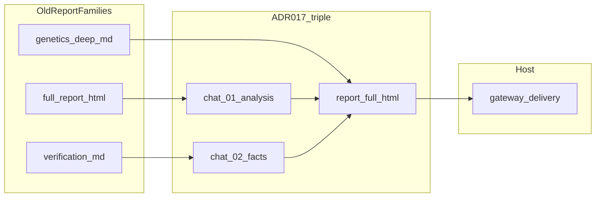

# RFO × OSS × old_reports — structure convergence

**Статус:** v1+ рабочий документ для согласования структуры отчётов, внешних OSS-паттернов и канона RFO v19. Wave 2 и длинные каталоги **не переписываются здесь** — только ссылки, оси и решения. Дополняется **decision records** по мере спорных развилок.

---

## Критерий успеха

- **Ложный dossier** не доходит до пользователя как «готово»: machine-гейты и честный manifest/audit, а не только «зелёный» HTML.
- **Claim → source_id → excerpt/body:** существенные утверждения опираются на проверяемый корпус источников; RAF/автоскоры **не** заменяют §E факт-чек (см. BUG-17).
- **Доставка:** доказана audit gateway / вложение **или** задокументированный fail — не самонадеянное «готово» в UI агента.
- **Не цель документа:** дизайн-галерея или раздувание входов; меньше законных способов «красиво соврать», больше явных gate и ссылок на код/ADR.

---

## Библиография и реестр слоёв

Один маркированный список источников с ролью для читателя convergence (wave 2 **не** дублируем — расширяем OSS-ось и канон git).

- **`REPORT-STRUCTURE-AND-BLOCKS-CATALOG.md`** (`_tmp/rfo/old_reports/`): ось **семейства выходов** — full-report, verification, genetics-deep, report.ru, analytical-note; §3.1–3.2 иерархия секций (`summary`, `facts`, `evidence`, …).
- **`OSS-ANALOGS-SEQUENTIAL-REVIEW.md`** (`_tmp/rfo_analogs/`): ось **22 репо**, группы в конце — MD+промпт, UI, post-merge, eval, infra, skills.
- **ADR-016 / ADR-017** (`docs/adr/`): граница **compute vs delivery** и **тройка deliverables**.
- **`references/full-html-report-contract.md`:** чат ≠ полная доставка HTML; блокирующие условия «нет файла = не сдано».
- **`docs/analytics/rfo-archive-passes/`:** README, **WAVE2-COMPREHENSIVE-COMPARATIVE-ANALYSIS**, **ARTIFACT-TAXONOMY.json** — эволюция контракта v11→v19 (ссылка + вехи ниже).
- **Снимки дерева скилла:** `_tmp/rfo/_a/.../research-factory-orchestrator/` и `_b/...` (оба зафиксированы с `runtime/version.json` 19.5.5 в археологии): сравнение **SKILL.md**, **CHANGELOG**, **schemas/** при подозрении на drift экспорта; иначе трактовать как **дубликат снимка**, не второй канон.
- **Канон кода:** репозиторий `research-factory-orchestrator/` под монорепо `aiSKILLS` — единственное место правок скилла; деплой под `/opt/openclaw/.../skills/` не источник истины.

---

## Golden path + диагностика

1. **Compute:** `rfo_runtime_core.py run` / execute с согласованным `--project-dir` и **`RFO_RUN_PROFILE`** (default и профили — `contracts/run-profiles.json`, деталь политики — `validation-profiles/<name>.json`).
2. **Артефакты:** тройка ADR-017 (`chat/01-analysis.md`, `chat/02-facts.md`, `report/full-report.html`) и сопутствующие JSON; **`result-manifest.json`** / маркер stdout — по контракту хоста (OpenClaw: ровно один `__OPENCLAW_SKILL_RESULT__=…`).
3. **Валидация:** `validation-transcript.json` заполняется **`scripts/run_core_validators.py`** по профилю. Статус **`pending_dag`** — признак обхода цепочки (исторический анти-паттерн; в каноническом рантайме после рендера вызывается полная цепочка; см. `RFO_SKIP_CORE_VALIDATORS` только для отладки).
4. **Delivery (v19.3+):** Telegram/канал — **gateway**, маршрут из входящего update (`OriginatingTo`, audit). Скилл **не** получает `--chat-id` / `--reply-to` в прод-пути compute.
5. **Класс боли (быстро):**
   - нет run-dir / manifest → пакет или argv;
   - неверный `runs-root` → хост;
   - маркер есть, файла нет в чате → delivery/gateway;
   - HTML ок, validation пустой или stub → **ложный dossier**;
   - два worker конфликтуют по очереди → lease/TTL (см. BUG-14).

---

## Ось A — семейства old_reports (заголовки каталога)

Без полного перечня файлов: типовые **семейства** для маппинга на слоты v19.

- **full-report*** — основной HTML-досье, hero / sidebar / long-form вариации.
- **verification-report*** — тёмная/верификационная ветка, чеклисты доказательности.
- **report.ru*** / split-style — язык и разбиение секций.
- **genetics-*-deep*** — глубокие тематические MD/HTML.
- **rfo-*** / **analytical-note*** — служебные и аналитические короткие формы.

**Куда в v19:** содержательные блоки → **`chat/01-*` / `02-*`** и тело **`report/full-report.html`** (данные из JSON + шаблон), либо поведение gateway; новый тип файла только с ADR.

---

## Ось B — вехи эволюции скилла (wave 2, теги без копипасты)

Пять–десять **якорных моментов** из оглавления WAVE2 / INDEX / taxonomy (уточнять по `docs/analytics/rfo-archive-passes/`):

- смена модели delivery vs artifact-only / triple deliverables;
- усиление proof-integrity и manifestов;
- развод relay vs dossier funnel;
- появление явных validation chains и профилей;
- convergence gatekeeper вместо «одного HTML без цепочки».

Использовать как **теги** для скрещивания с OSS и семействами отчётов, не как второй отчёт по wave 2.

---

## Ось C — группы OSS (сводная ось реестра)

Коротко по группам из **OSS-ANALOGS-SEQUENTIAL-REVIEW** (детали — в исходном файле):

- структурированный markdown + промпт-надстройки;
- UI / визуализация отчёта;
- post-merge / CI‑гейты;
- eval и бенчмарки;
- infra (изоляция, очереди);
- skills / упаковка агента.

**Куда в v19:** принципы → harness и validators; целые репо — **не** тащить в execute без отдельного ADR/skill.

---

## Ось X × ось Y (каталог old_reports × OSS)

Без копипасты длинных § каталога и без пересказа 22 репо — только **имена осей** для скрещивания.

- **Ось X (каталог §1–5):** семейства выхода и блоки из **`REPORT-STRUCTURE-AND-BLOCKS-CATALOG.md`** — что считалось «формой отчёта» в корпусе `old_reports` (семейства + §3.1–3.2 иерархия секций).
- **Ось Y (OSS-реестр):** группы и паттерны из **`OSS-ANALOGS-SEQUENTIAL-REVIEW.md`** (MD+промпт, UI, post-merge, eval, infra, skills) — откуда брать **идею**, не второй контракт файлов.

**Черновая матрица сопоставлений** (списком «семейство × группа OSS → куда в v19», без `|таблиц|`):

- **full-report / long HTML × UI + MD+prompt** → тройка ADR-017 + детерминированный `report/full-report.html` из данных; LLM — в `chat/*` и JSON, не в ad-hoc новый тип файла.
- **verification-report × eval / CI gates** → секции `#verification` / framing; machine-цепочка `run_core_validators` + честный `validation-transcript.json`.
- **report.ru / split narrative × structured decomposition** → `executive_summary` / spine в archetype + sandwich harness; язык RU по умолчанию.
- **genetics-deep / thematic MD × science / dataset OSS** → archetypes `science_literature_review`, `dataset_centric_report`; слоты `#facts`, `#evidence`, `#appendix`.
- **rfo-* / analytical-note × skills / infra** → служебные артефакты run-dir, audit, не смешивать с пользовательским HTML без ADR.

---

## Native slash vs legacy (ожидания оператора)

**Production v19.3 (OpenClaw Telegram):**

- Slash **`/research_factory_orchestrator`** → native handler → детерминированный Python entry → артефакты → маркер stdout → **gateway** доставляет документ в тот же чат/тред, откуда пришёл запрос.

**Legacy / operator-only:**

- **`interface_runtime_adapter`**, queue/outbox worker, ручные argv с целевым чатом — документировать как **legacy**, чтобы не смешивать ожидание «ответ пришёл в Telegram» с тестовым запуском из IDE.

---

## Сопоставления и decision records

Широкие матрицы OSS×old_reports **не** обязательны. Спорная ячейка → запись вида:

### Decision: comparative_analysis vs mobile

**Old pattern:** archetype `comparative_analysis` допускает `comparison_matrix`.  
**OSS / v19 слот:** пользовательский HTML — **stacked cards** или сжатый `dl`; полная таблица только в appendix по якорю.  
**Gate:** mobile-first в § продуктовых ограничениях; правка `report-archetypes.json` / промпта — после согласования.  
**Anti-pattern:** широкая матрица в основном теле на узком экране.

### Decision: citation_triad

**Триггер:** нерусский первоисточник + нужна дословность.  
**Слот:** внутри `#evidence` / `#facts` / `#sources` — три блока: оригинал → перевод RU → краткая справка по источнику RU.  
**Gate:** не ломает правило «отчёт на русском» для оболочки и саммари.

### Decision: §E fact-check артефакт

**dossier / OSINT-sensitive:** `chat/03-fact-check.md` **обязателен** (must).  
**light / search-primary:** объём по профилю, optional.  
**Gate:** не заменяет починку V2–V6 и evidence в коде.

---

## Колонка «Куда в v19»

Для каждого переносимого паттерна из старых отчётов и OSS:

1. **`chat/01-analysis.md`**, **`chat/02-facts.md`**, **`report/full-report.html`** — основные слоты ADR-017.
2. **Gateway-only** — уведомление, доставка, audit, короткое резюме в Telegram без дублирования полного HTML в сообщение.
3. **Out of scope для execute** — отдельный skill (например DOCX-merge как у внешних оркестраторов).

---

## OSS leverage — shortlist (5–7 приоритетов)

1. **Plan JSON → fill:** второй проход только на сборку отчёта (как у JSON-research → report-agent паттернов в реестре OSS).
2. **Structured plan / decomposition** перед narrative — снижает lost-in-the-middle (sandwich + короткий план в каждом turn).
3. **Validation layers** — много узких ворот вместо одного «LLM POST» (`validate_skill`, `validate_release`, core validators chain).
4. **Observability / audit** — gateway audit trail для доставки; не доверять только stdout модели в UI.
5. **open_deep_research‑style Sources block** — как ориентир секции источников (адаптация под RU и схему v19).
6. **Conclusion-up-front + review loop** — как принцип для executive слотов (без жёсткой привязки к одному репо).
7. **DOCX / merge pipelines** — явно **после** RFO как отдельный skill, не раздувание execute.

---

## Рецепты и archetypes (канонический JSON)

**Меню рецептов:** `templates/archetypes/report-archetypes.json` — у каждого `id`: `required_blocks`, `preferred_blocks`, `avoid_blocks`, `mobile_notes`, `failure_modes`, `best_for`.

**Секции каталога §3.1** (`summary`, `framing`, `facts`, `verification`, `timeline`, `evidence`, …) **маппятся** на блоки archetype (например `chronology` → `#timeline`, `verdict` → `#verification` / summary).

**OSINT / INT лексикон** (см. `docs/project-handoff-v18.1.1.md` §10–11): намёк на archetype — медиа/IO → narrative analysis; цифры/рынок → market/overview; риск → risk_memo; наука → literature_review; смешанное → compose.

**Скрипт:** `scripts/select_report_archetype.py` — опционально в рантайме; для LLM достаточно **одного** archetype из JSON + маппинг на `#id` секций.

**Якорные `archetypes[].id` → §3.1 каталога** (для рецептов и промптов; при расхождении с `mobile_notes`/`comparison_matrix` действует **Decision: comparative_analysis vs mobile** выше):

- **`entity_profile`** — `summary`, `framing`, `facts`, `timeline`, `sources`; IO/репутация → `relations`, `public_activity`.
- **`company_due_diligence`** — `summary`, `facts`, `risks`, `verification`, `sources`; финансы → `#facts` / appendix.
- **`person_investigation`** — `framing`, `facts`, `timeline`, `hypotheses`, `sources`.
- **`fact_check`** — `verification`, `evidence`, `facts`, `confidence`, `sources`; обязателен §E / `03-fact-check` при dossier.
- **`timeline_reconstruction`** — `timeline`, `facts`, `evidence`, `sources`.
- **`comparative_analysis`** — `summary`, `facts`, `risks`; матрица сравнения → stacked cards / `dl`, не wide table в теле.
- **`market_overview`** — `summary`, `facts`, `forecast`, `risks`, `sources`.
- **`technology_landscape`** — `framing`, `facts`, `hypotheses`, `sources`.
- **`narrative_media_analysis`** — `framing`, `facts`, `evidence`, `sources`; при нерусских цитатах — **`citation_triad`** внутри `#evidence`.
- **`science_literature_review`** — `facts`, `evidence`, `confidence`, `appendix`, `sources`.
- **`dataset_centric_report`** — `facts`, `evidence`, `appendix`, `sources`.
- **`risk_memo`** — `summary`, `risks`, `bottom-line`, `confidence`, `sources`.
- **`compose_from_components`** — порядок секций из `required_blocks` выбранных компонентов → те же `#id`, что в §3.1.

---

## § LLM block kit (спина + палитра + рецепты)

**Spine (жёсткий минимум):** слоты ADR-017 + обязательные файлы для профиля.

**Palette:** опциональные секции из каталога old_reports + выжимка OSS; у блока в промпте: `id`, триггеры, анти-паттерны, одна пример-фраза.

**Спека блока (для промптов):**

- **`html_hint`:** mobile (одна колонка, без обязательных wide tables).
- **`language`:** `ru` для пользовательского текста отчёта.
- **`citation_triad`:** опционально для нерусских цитат (см. выше).
- **`full_draft_fact_check`:** отсылка к §E и `chat/03-fact-check.md`.
- **`operator_nudge` / §F:** анти-лень, без KPI на скорость.
- **`telegram_summary`:** краткая честная выжимка для чата, не замена файлов.

**03-fact-check:** **must** для dossier и чувствительных OSINT-профилей; optional для light.

---

## § LLM harness (§A–F полный смысл)

**§A Забывает рецепты:** sandwich в конце каждого user-turn; короткий JSON-план перед длинным текстом; живой чеклист в run-dir; archetype = вырезка из **одного** объекта `report-archetypes.json`.

**§B Нет доставки / wrong-surface:** развести чат агента и Telegram; «сдано» = маркер + manifest + доставка в **ожидаемый** чат или задокументированный fail. См. ADR-016 и **full-html-report-contract**.

**§C Усиление:** prompt-only → SKILL → **machine validators** → человек.

**§D Библиография convergence:** agentic / decomposed report generation; structured extraction; 1–2 репо из OSS-реестра с паттерном JSON → второй pass отчёта.

**§E Полный факт-чек драфта:** каждое существенное утверждение → опора в `sources` или ослабление/удаление; перечитать корпус источников, не только память диалога.

**§F Анти-лень:** один канонический блок (5–8 строк RU) в каждом turn (`turn_start.md` на стороне хоста); не сокращать шаги под скорость.

**Язык:** пользовательские отчёты **RU** по умолчанию; акронимы (OSINT, ADR) допустимы; не переключать язык mid-paragraph вне `citation_triad`.

**Две поверхности:** (1) артефакты + `full-report.html`, (2) Telegram — ходовые сообщения + итог в исходный диалог. **Запрет:** хардкод chat/channel в argv скилла для прод-пути.

**Machine vs prompt:** маркер, manifest, наличие файлов, цепочка validators — machine; sandwich и §F — prompt; таблица «что gate’ится кодом» держится короткой в runbook skill.

---

## Forensic: BUG-1–17 (якорь + opt-openclaw)

Реестр приоритизации; детали — тикеты и якорные `run_id`.

- **BUG-1 / BUG-10:** после рендера не вызывалась **`run_core_validators.py`**; писался **`pending_dag`**. **Remediation (канон):** `cmd_run` после артефактов вызывает **`scripts/run_core_validators.py --run-dir … --profile <profile>`**; опциональный skip через **`RFO_SKIP_CORE_VALIDATORS`**.
- **BUG-2:** расхождение **`contracts/run-profiles.json`** и **`validation-profiles/*.json`** по **`active_validators`**. **Remediation:** списки выровнены с профильными JSON (dossier / search-primary).
- **BUG-3:** **`content_snippet`** отбрасывался при нормализации. **Remediation:** поле в схеме и capped сохранение в **`normalize_source_record_v19`**.
- **BUG-4:** boilerplate evidence вместо тела источника.
- **BUG-5:** порядок hydrate vs claims-registry / dossier.
- **BUG-6:** V3 искал **`source-policy.json`** только рядом с `sources.json`. **Remediation:** также **`sources/source-policy.json`**.
- **BUG-7:** агрессивные enum-map без семантики.
- **BUG-8:** scaffold memo/dossier/io-check.
- **BUG-9:** latin-1 на кириллице.
- **BUG-11 / BUG-15:** scaffold wave/feature-truth-matrix.
- **BUG-12:** однообразные **`supports: direct`**.
- **BUG-13:** **`build_sacred_path_graph`** не был в worker-пути → нет **`sacred-path-graph`** до цепочки. **Remediation:** цепочка **`run_core_validators`** включает нужные шаги (скрипт уже вызывает генерацию графа где положено).
- **BUG-14:** гон за **`queue/worker.lease`**. **Remediation:** атомарное создание (**`O_CREAT | O_EXCL`**) после опционального снятия stale lease.
- **BUG-16:** bridge **`allow_gate_stub`** — только наличие файлов.
- **BUG-17:** RAF vs пустые snippets/claims — требуется аудит формулы и входов **`citation_grounding.evaluate`**.

**Стадии работ (напоминание):** Stage 0 lease + validators pipeline; Stage 1 snippet + профили; Stage 2 кодировки и best-effort; Stage 3 наполнение deliverables.

---

## Tier 0 — чеклист одним проходом

- `run.json`, `result-manifest.json`, маркер stdout (если контракт хоста).
- **`validation-transcript.json`:** не застревать на **`pending_dag`** при ожидании полной цепочки; видны реальные валидаторы.
- **`validation-profile-used.json`** согласован с запуском.
- Доля непустых **`content_snippet`** там, где relay/fetch заполняет тело.
- **`validation/sacred-path-graph.json`** при профиле с traceability/V2.
- Bridge flags: осознанный риск «зелёных пустышек» (BUG-16).
- Multi-worker: атомарный lease (BUG-14).

---

## Архитектура: old families → тройка + gateway

**Что уже хорошо:** ADR-016/017; **`artifact_execute_impl`** проверяет обязательные пути; **`validate_release`** как многослойный gate; тонкий **SKILL.md** с progressive disclosure.

**Где «тонет лодка»:** слишком много законных entrypoints для одной модели; путаница relay vs dossier; смешение legacy adapter с prod native path.

**Tier 0–5 (кратко):** сузить входы; выровнять профили и validators; кодировки и fetch; наполнение scaffold артефактов; внешние ссылки на plan-then-execute и validation gates в индустрии.

---

## Продуктовые ограничения (mobile / Telegram)

- HTML: **mobile-first**, без горизонтального скролла как нормы.
- Сравнения в пользовательском HTML и в **этом** markdown: списки и подзаголовки, не широкие таблицы; редкая узкая таблица (≤2 колонки) с явной оговоркой.
- Telegram: резюме честное по существенным утверждениям (§E); не дублировать полный HTML в одно сообщение без политики хоста.

---

## Регрессия и якорные прогоны

После изменений в рантайме/схемах: прогон **`pytest`** в пакете скилла и smoke **`validate_skill`** по документации релиза; якорный run с фиксированным профилем и сохранением **`run_id`** для сравнения **до/после** (без обязательной широкой таблицы — два bullet «ожидалось / получилось»).

---

## История версий документа

- **v1 (2026-05-12):** skeleton + BUG-1–17 + golden path + mermaid.
- **v1.1:** библиография слоёв, оси A/B/C, decision records, native vs legacy, расширенный harness §A–F, leverage shortlist, archetypes anchor, remediation bullets BUG-1/2/3/6/13/14.
- **v1.2:** ось X×Y (каталог × OSS), черновая матрица сопоставлений списком, полный маппинг **`report-archetypes.json`** id → §3.1.
