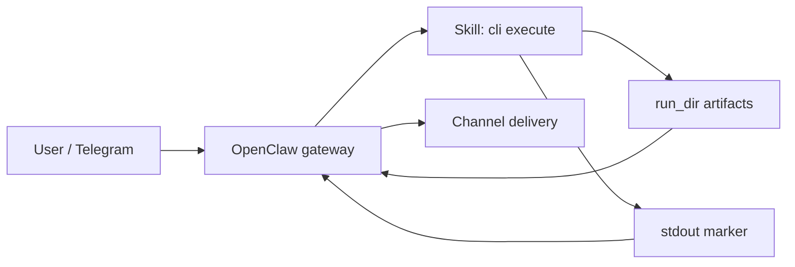

# ADR-016 — RFO compute vs delivery split (v19.3 artifact-only)

## Status

Accepted — supersedes operational assumptions in ADR-014 for **who** performs channel delivery.

## Context

External audits of v19.2.1 showed `interface_runtime_adapter` queues work; the worker performs render+package; outbox/Telegram adapters perform delivery. A gateway hook placed **after** adapter exec only sees `{"queued": true}` and an empty or incomplete `run_dir`.

## Decision

1. **Skill (RFO) is compute-only** for the native `/research_factory_orchestrator` path: synchronous `cli execute --runs-root --task` allocates `run_dir`, renders artifacts, writes `final-answer.md`, `result-manifest.json`, `marker.json`, and prints **exactly one** stdout capsule `__RFO_SKILL_AGENT_HANDOFF__=<json>` with neutral `instructions_for_invoking_agent` (all other diagnostics on stderr).
2. **OpenClaw gateway** parses the marker, validates `result-manifest.json` (JSON Schema + relative paths + sha256), delivers via the existing channel adapter (e.g. Telegram `sendMessage` / `sendDocument`), records audit, and **suppresses** the model-generated user reply on this path.
3. **`final-answer-gate.json`**: in artifact mode, `passed` MAY be `true` when content is ready and delivery is explicitly deferred to the gateway (`status` documents gateway ownership); legacy `content_ready_delivery_not_proven` remains for queue/outbox flows.

## MUST / MUST NOT (skill)

**MUST**

- Allocate isolated `run_dir` under canonical `RUNS_ROOT`.
- Emit `final-answer.md`, `result-manifest.json`, `marker.json`, package zip when required paths exist.
- Emit stdout marker as the last non-empty stdout line; exit code aligned with manifest `status`.

**MUST NOT**

- Accept `chat_id`, bot tokens, or Telegram API base in argv/env for execute mode.
- Call Telegram or webhook delivery from the skill process.

## MUST / MUST NOT (gateway)

**MUST**

- Pass only `--task` and `--runs-root` into skill execute.
- Validate manifest before delivery; on failure send a technical ack and do not substitute an LLM “summary” of stdout.

**MUST NOT**

- Pass `chat_id` into the skill argv/env.
- Infer `run_dir` by “latest directory” when a marker is present.

## Consequences

- Validator matrix drops mandatory in-skill Telegram smokes; release adds `validate_artifact_release` / artifact smoke gates.
- ADR-014 remains valid for **operator** control-plane concerns; delivery proof for user-visible Telegram moves to **gateway audit** on the native route.

