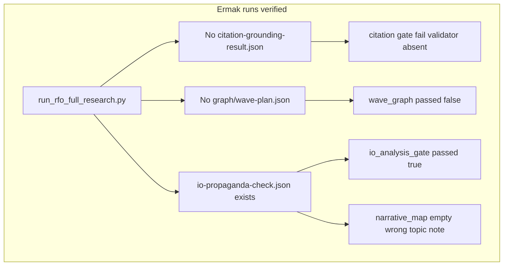

# План: починить RFO end-to-end (обновление по кейсу arest_ermaka)

Существующая логика плана (корневая причина `citation-grounding-result.json`, ветки A/B, `ensure_pkg`, порядок внедрения) **сохраняется** — см. предыдущую версию в workspace plan и [research-factory-orchestrator/docs/diagnostics/opt-openclaw-rfo-prod-forensics-2026-05-11.md](research-factory-orchestrator/docs/diagnostics/opt-openclaw-rfo-prod-forensics-2026-05-11.md).

## Версионирование (итерация оператора)

**Текущая версия в каноническом** `[research-factory-orchestrator/SKILL.md](research-factory-orchestrator/research-factory-orchestrator/SKILL.md)`: `**19.3.1`** (`version` и `release` во frontmatter).

**Правило «x.x+1»:** при внедрении изменений по этому плану целевой номер релиза скилла — `**19.4.0`** (увеличение **средней** цифры семвера на 1; patch `19.3.2` не использовать как основной целевой номер для этой волны работ — она про поведение/оркестрацию, не только микропатч).

**Статус сейчас:** в режиме плана файлы репозитория **не** менялись; при явном **execute** первый коммит с кодом по плану должен включать todo `**semver-bump-minor`** (или отдельный релизный коммит сразу после стабилизации фич).

---

## Наследие: шаблоны ответов, HTML-отчёты, промпты фокуса анализа (аудит дерева + git)

Источник: канон `[research-factory-orchestrator/research-factory-orchestrator/](research-factory-orchestrator/research-factory-orchestrator/)`; коммиты `**a1bc11e` (v19.2)** и `**4987736` (v19.1)** — набор `templates/`** и worker-промптов **уже широкий**; каталог `**prompts/roles/`** появился позже (`**5f3026e**` — bridge handoff / bundle).

### 1) HTML отчёты (несколько слоёв — не путать)

| Артефакт                                                                                                                                                        | Назначение                                                                                                                                                                                                                                                                                                                                                                                                                                                                                                                                         |
| --------------------------------------------------------------------------------------------------------------------------------------------------------------- | -------------------------------------------------------------------------------------------------------------------------------------------------------------------------------------------------------------------------------------------------------------------------------------------------------------------------------------------------------------------------------------------------------------------------------------------------------------------------------------------------------------------------------------------------- |
| `[templates/full-report-template.html](research-factory-orchestrator/research-factory-orchestrator/templates/full-report-template.html)`                        | **Канонический** single-file досье: `lang=ru`, секции (executive summary, verdict, scope, methodology, search strategy, source quality, IO/propaganda, …), плейсхолдеры `{{TITLE}}`, `{{EXECUTIVE_SUMMARY}}`, … Заполняется из run-dir JSON через `[runtime/report_html.py](research-factory-orchestrator/research-factory-orchestrator/runtime/report_html.py)` — см. [ADR-017](research-factory-orchestrator/research-factory-orchestrator/docs/adr/ADR-017-html-wiki-citations-and-template.md) (wiki `[n]` → `#ref-n`, без выдуманных ссылок). |
| `[templates/final-report-template.html](research-factory-orchestrator/research-factory-orchestrator/templates/final-report-template.html)`                      | **Англоязычный скелет** «Final Research Report» с секциями-заглушками и комментариями «evidence-backed» — скорее **ориентир структуры**, не активный пайплайн v19.3 HTML.                                                                                                                                                                                                                                                                                                                                                                          |
| `[templates/full-report-standalone-template.html](research-factory-orchestrator/research-factory-orchestrator/templates/full-report-standalone-template.html)`  | Вариант standalone; сверять с ADR-017 / `render_full_html_report` что реально используется в прод-пути.                                                                                                                                                                                                                                                                                                                                                                                                                                            |
| `[templates/components/*.html](research-factory-orchestrator/research-factory-orchestrator/templates/components/)`                                              | Переиспользуемые куски (claim-card, executive-summary, timeline, wide-table, …) — связка с отчётной семантикой.                                                                                                                                                                                                                                                                                                                                                                                                                                    |
| `[templates/assets/report-theme.css](research-factory-orchestrator/research-factory-orchestrator/templates/assets/report-theme.css)` + `report-enhancements.js` | Тема/UX для HTML (внутренний single-file — политика «без внешних CDN» изнаследована из v12 prep, см. ниже).                                                                                                                                                                                                                                                                                                                                                                                                                                        |

### 2) Шаблоны «ответа» (Markdown / чекпойнты / Telegram)

| Артефакт                                                                                                                                   | Назначение                                                                                                                                                       |
| ------------------------------------------------------------------------------------------------------------------------------------------ | ---------------------------------------------------------------------------------------------------------------------------------------------------------------- |
| `[templates/final-delivery-template.md](research-factory-orchestrator/research-factory-orchestrator/templates/final-delivery-template.md)` | Структура финальной выдачи: executive summary, findings, analysis, claims table, citations, limitations + пути к runtime-артефактам (`{{PROJECT_DIR}}`, trace).  |
| `[templates/checkpoint-template.md](research-factory-orchestrator/research-factory-orchestrator/templates/checkpoint-template.md)`         | Промежуточный чекпойнт для возобновляемости.                                                                                                                     |
| `[templates/telegram/plain-*.txt](research-factory-orchestrator/research-factory-orchestrator/templates/telegram/)`                        | **Plain text** сегменты для канала (key findings, facts, sources, gaps, verdict) — исторически жёсткое требование v12: не HTML parse_mode в обязательной выдаче. |

### 3) Промпты и политики, **форсирующие** качество анализа (не «красивый текст», а дисциплина)

| Файл                                                                                                                                                                                                                                                       | Суть                                                                                                                                                                                                |
| ---------------------------------------------------------------------------------------------------------------------------------------------------------------------------------------------------------------------------------------------------------- | --------------------------------------------------------------------------------------------------------------------------------------------------------------------------------------------------- |
| `[prompts/source-quality-worker-prompt.md](research-factory-orchestrator/research-factory-orchestrator/prompts/source-quality-worker-prompt.md)`                                                                                                           | Классификация источника (origin, publisher, independence, distortion…) + **fit source↔claim**; явный запрет на laundering (пресс-релиз ≠ верификация, репринты ≠ независимость).                    |
| `[prompts/context-integrity/context-loading-worker-prompt.md](research-factory-orchestrator/research-factory-orchestrator/prompts/context-integrity/context-loading-worker-prompt.md)`                                                                     | Короткий гард: не заявлять «полное чтение» без манифестов/ledger.                                                                                                                                   |
| `[templates/evaluation-rubric.md](research-factory-orchestrator/research-factory-orchestrator/templates/evaluation-rubric.md)`                                                                                                                             | Числовые пороги (factual_accuracy, citation_*, completeness, …) и **mandatory** `output_contract_compliance` / `safety_compliance` = 1.0.                                                           |
| `[templates/source-policy.md](research-factory-orchestrator/research-factory-orchestrator/templates/source-policy.md)`, `[source-evaluation-policy.md](research-factory-orchestrator/research-factory-orchestrator/templates/source-evaluation-policy.md)` | Нормы отбора и оценки источников.                                                                                                                                                                   |
| `[templates/archetypes/report-archetypes.json](research-factory-orchestrator/research-factory-orchestrator/templates/archetypes/report-archetypes.json)`                                                                                                   | **Тип отчёта** → `required_blocks` / `preferred_blocks` / `failure_modes` (entity profile, due diligence, …) — готовый материал для **LLM-узла планирования структуры** без генерации HTML моделью. |
| Протоколы `templates/*-protocol.md`, state machines (`global-state-machine.md`, `item-state-machine.md`, …)                                                                                                                                                | Операционная дисциплина пайплайна (очереди, компилятор, executor) — для документации и для **системных** промптов оркестратора, если выносить в LLM.                                                |

### 4) Роли для **downstream** агента (после рана)

В `[prompts/roles/](research-factory-orchestrator/research-factory-orchestrator/prompts/roles/)`: `user-facts-collection.md`, `user-task-summary.md`, `analytics-from-run-artifacts.md` — контракты **вход/выход/evidence boundary**; в `[artifact_execute_impl.py](research-factory-orchestrator/research-factory-orchestrator/runtime/artifact_execute_impl.py)` они перечислены в `prompt_roles` для handoff bundle.

### 5) Исторический «большой» интеграционный промпт v12

`[reports/research-factory-orchestrator/prep-CURSOR-PROMPT-INTEGRATE-V12.md](reports/research-factory-orchestrator/prep-CURSOR-PROMPT-INTEGRATE-V12.md)` — чеклист интеграции v12 report delivery: standalone HTML, plain Telegram, semantic-report → full-report, валидаторы final-answer gate. Полезен как **референс требований к выдаче**, даже если часть шагов уже переписана под v19.

### Связь с планом LLM-оркестрации

При внедрении `**llm-orchestration-steps`** переиспользовать уже существующие **дисциплинарные** тексты (`source-quality-worker`, `evaluation-rubric`, `report-archetypes`) как **вставки или ссылки** в промпты узлов «план векторов / ранжирование сниппетов», чтобы не плодить новую «мягкую» инструкцию с нуля. HTML по-прежнему собирать **шаблоном + JSON**, не моделью (политика + ADR-017).

---

## Репозитории-аналоги `_tmp/rfo_analogs/repos` (вдохновение, не канон)

Путь: `/home/kazak/_projects/_tmp/rfo_analogs/repos/`. Внешние клоны — переносить **идеи**, не код целиком.

### `research_orchestrator/`

- Фазовый оркестратор в SKILL: Parse → Compare → Verify → Merge; **JSON между фазами** (`inventory.json`, `comparison.json`, `verification.json`).
- **Чекпойнт с оператором** после Compare перед Verify.
- Верификация: скрипты ссылок + tier источников — образец разделения «детерминированная проверка / рассуждение».

### `awesome-deep-research-agent/`

- Обзор DR-агентов (статические vs динамические workflow, search API vs browser) — материал для **доков/ADR**, не зависимость рантайма.

### `ssdeanx-deep-research/` (Mastra)

- Шаги workflow с **zod-схемами**, suspend/resume.
- **Двухфазный промпт:** Phase 1 — 2–3 начальных запроса; Phase 2 — поиск по **follow-up из learnings**, STOP; структурированный JSON (`queries`, `searchResults` с `relevance`, `learnings.followUpQuestions`, `completedQueries`, `phase`).
- **`evaluateResultTool`:** LLM на каждый hit — `isRelevant` + `reason` + дедуп URL — прототип узла «ранжирование / разумность до fetch» из **`llm-orchestration-steps`**.

### Перенос в RFO

- Двухфазный цикл + archetypes; human checkpoint → для headless заменить артефактом (`events.jsonl` / hints file).
- Релевантность сниппетов: узкий LLM на top-K в рамках `execution-reliability-policy`.

---

## Ожидание продукта: «RFO не должен быть быстрым» (итерация плана)

**Смысл жалобы «RFO сломан»:** ожидается **много запросов по волнам**, добор источников, анализ **плоскостей исследования** (оси/подвопросы), осмысленная длительность — а не «один SearXNG-запрос + fetch + быстрый отчёт».

**Факт по коду сейчас:** `[run_rfo_full_research.py](research-factory-orchestrator/research-factory-orchestrator/scripts/run_rfo_full_research.py)` — это **намеренно лёгкий** драйвер: один relay-поиск, лимит результатов, без fanout из `query-fanout-config.json`, без полноценного wave-плана как у тяжёлого пайплайна. Он **не претендует** на поведение «исследовательского оркестратора» из worker/bridge, если тот ещё доступен в деплое.

**Вывод для плана:** «сломан» — это **разрыв между обещанием скилла и фактическим entrypoint’ом** (сейчас `run_rfo_full_research.py` отрабатывает быстро и узко). Отдельно остаётся инженерная линия citation/гейтов.

**Решение оператора (зафиксировано):** скилл **всегда** обязан выполнять **очень глубокое** исследование (много запросов, волны, анализ плоскостей темы); «быстрый минимальный» режим как норма для пользователя **не приемлем**. Технически это todo `rfo-product-waves-vs-fast`: либо **нарастить** текущий вызываемый скрипт до полноценной оркестрации (как у worker: fanout, волны, добор), либо **сделать единственным** поддерживаемым путём выполнения тот entrypoint, где глубина уже реализована, и синхронизировать SKILL/обвязку так, чтобы хост никогда не вызывал урезанный драйвер под видом полного исследования. Формулировки про «опциональный флаг глубины» не являются сутью продукта — глубина не опциональна.

---

## История навыка в git (что «было» до нынешней путаницы)

Проверено репо `**/home/kazak/_projects/aiSKILLS`** (канонический пакет под `research-factory-orchestrator/research-factory-orchestrator/`).

1. `**scripts/run_rfo_full_research.py` появился только в `cf7b09f**` (сообщение коммита: sync v19.3 ← canonical /opt). **Вся история файла — 6 коммитов**, все после этой точки. В **первом** же содержимом (`git show cf7b09f:…/run_rfo_full_research.py`) уже заданы `**_MAX_RESULTS = 10`**, один поток `**search_searxng**`, стратегия «Search Primary» / fetch — **не было этапа с multi-vector fanout** в этом файле никогда.
2. **До v19.3** на коммите `**a1bc11e` (v19.2.0 «runtime truth»)** файлов `**run_rfo_full_research.py` и `run_rfo_with_web_search.py` нет** в `scripts/`. Точка входа «фабрики» была `**run_research_factory.py`** — тонкая обёртка: `runpy` → `**rfo_runtime_core.py` `run**` (полноценное ядро пайплайна того поколения). Параллельно в дереве были `**runtime_job_worker.py**`, `**outbox_delivery_worker.py**` и т.д.
3. `**run_rfo_with_web_search.py` тоже добавлен в `cf7b09f**` (та же синхронизация v19.3). В **текущем** коде там явно: `**fanout_relay_search`**, шаг `**[1/5] Multi-vector JSON relay fanout**`, merge/dedup, запись `**relay_query_fanout**` в `collection-result.json` — это и есть ближайший в репозитории аналог ожидания «много запросов / волны». То есть «как было задумано глубоко» для relay-ветки — **не** `run_rfo_full_research.py`, а **bridge-скрипт** (и док `[docs/runtime-paths.md](research-factory-orchestrator/docs/runtime-paths.md)` уже называет его нативным relay-путём).
4. **Вывод для починки:** регресс ощущений — не «сломали волны внутри full_research», а **подмена или рекомендация entrypoint’а**: агенты/операторы запускают `**run_rfo_full_research.py`**, ожидая поведение `**run_rfo_with_web_search.py**` / старого `**rfo_runtime_core**`. Плановый todo `rfo-product-waves-vs-fast` должен **свести к одному** поведению «всегда глубоко»: либо внутрь `run_rfo_full_research` перенести оркестрацию уровня bridge, либо запретить full_research как пользовательский «золотой путь» и везде вызывать bridge/ядро.

---

## Предшественник «Deep Investigation Agent» и субагентная оркестрация (операторская память)

Оператор описал целевой **не-git-only** опыт (и предшественник навыка):

- **Пять субагентов**, каждый в своём **векторе** по теме, с **фиксацией в файл**.
- **ЛЛМ-оркестратор**: разбор запроса, при необходимости микропоиск для контекста, выдача **направлений** — тоже с записью в файл.
- Затем **анализ и волна добора** при нехватке данных (снова файлы).
- **Многоосевой анализ** (десятки осей) — артефакты в файлах.
- **Пропаганда / IO** — отдельный анализ с фиксацией.
- **Сборка одного большого MD**, затем **HTML на русском**, затем **пост(ы) в канал** источника запроса.
- **Проблема:** субагенты **отваливаются по таймауту** на тяжёлых запросах.

Сопоставление с **текущим репозиторием RFO:**

- В `[docs/project-handoff-v18.1.1.md](research-factory-orchestrator/docs/project-handoff-v18.1.1.md)` целевой конвейер v18 всё ещё формулируется как **job → worker → research runtime → work-unit plan → workers/subagents/tool calls → … → HTML → outbox** — это **близко по духу** к описанной волновой машине (явное состояние, очередь, артефакты), даже если реализация ушла от «одна LLM дирижирует пятью чат-субагентами» к **исполняемому рантайму**.
- В `[policies/execution-reliability-policy.json](research-factory-orchestrator/policies/execution-reliability-policy.json)` явно заложены `**subagent_expected_window_sec`: [30, 90]** и лимиты work-unit — то есть **короткие окна** и протокол partial/retry; это **объясняет** наблюдаемые таймауты субагентов на тяжёлых темах, если оркестрация всё ещё опирается на них без **дробления / continuation_packet / shrink**.
- В `[SKILL.md](research-factory-orchestrator/SKILL.md)` и корпусе сбоев зафиксирован анти-паттерн **plain subagent вместо рантайма** — это **намеренный поворот v19** против «субагент прочитал SKILL и сделал вид». Он **конфликтует с ностальгией** по «LLM + 5 субагентов», если последнее понималось как **замена** файловому рантайму, а не как **режим внутри** него с теми же машинно-проверяемыми артефактами.

**Про «Курсор затирает лишнее»:** в git виден сдвиг v19.3: появились **новые** entrypoint’ы (`run_rfo_*`), урезанный `full_research` vs **fanout** в `run_rfo_with_web_search`, перепись доставки/контрактов. Операторское ожидание «как Deep Investigation» могло **не перенестись** в SKILL как **пошаговый сценарий волн**, а замениться на **валидаторы и stub/gateway** — это зафиксировать в `skill-runtime-contract-docs` + `rfo-product-waves-vs-fast` как **восстановление смысла**, а не только багфиксы.

---

## Обход `_projects/_tmp` и `**/home/kazak/_projects/_tmp/rfo`** (архивы версий)

1. `**/home/kazak/_projects/_tmp**` (корень): glob `*.zip` / `*.tar.gz` — **0 файлов**. Упакованной линейки версий там нет.
2. `**/home/kazak/_projects/_tmp/rfo`** (путь от оператора): не zip-лента, а **две распакованные копии** дерева скилла — `**_a/research-factory-orchestrator/`** и `**_b/research-factory-orchestrator/**` (41 файл суммарно). Обе помечены как **«Local Artifact Runtime v19.5.5»**; отличие `_b`: дополнительная секция **Source packet** в `SKILL.md` (`--source-packet`, без сети).
3. **Что внутри этих снимков (важное для сопоставления с вашим Deep Investigation):**
  - **Нет пяти субагентов и нет LLM-оркестратора** — один синхронный пайплайн `[runtime/run.py](file:///home/kazak/_projects/_tmp/rfo/_a/research-factory-orchestrator/runtime/run.py)`: `analyse_task` → `write_reports` → manifest → validate; **явно «no network calls»** в `[runtime/analysis.py](file:///home/kazak/_projects/_tmp/rfo/_a/research-factory-orchestrator/runtime/analysis.py)`.
  - **Много «осей» пропаганды/ИО** зашито **детерминированно** в коде: список `PROPAGANDA_METHODS` (~12 методов с паттернами и рисками) — это ближайший аналог «десятки осей», но **не** волна внешнего добора и **не** субагенты.
  - **Шаблон артефактов под канал/гейтвей:** `SKILL.md` задаёт дерево `runs/<run_id>/` с `**chat/01-analysis.md` … `04-artifacts-and-limits.md`**, `report/full-report.html`, `data/*.json`, маркер `**__RFO_RESULT__=**` — порядок «сначала куски в md, потом большой html» **частично** отражён, но **без** SearXNG-волн и **без** постов в канал внутри скилла (явно запрещено).
4. **Вывод:** `_tmp/rfo` — это **ещё одно упрощение** (локальный артефактный рантайм без сети), **не** архив эры «5 субагентов + добор». Он полезен как **контраст**: показывает, куда катился продукт (короткий детерминированный путь + жёсткий маркер), и почему ощущение «всё затирают» — **новый слой контрактов** вместо описанного вами **оркестра волн**.
5. **Соседство:** `**_tmp/rfo_analogs/`** — OSS deep-research для сравнения fanout/collector; `**rfo_analogs/repos/research_orchestrator**` — чужой merge-скилл.

Плановое действие: todo `**predecessor-artifact-mining**` — если появятся **другие** каталоги/zip с **ранней** Deep Investigation / pre-v19.3 оркестрацией, дополнить выжимку; для `_tmp/rfo` выжимка выше уже зафиксирована в плане.

---

## Промежуточные вызовы LLM внутри скилла (итерация требований)

**Запрос оператора:** нужно **больше оперирования скиллом моделью** — не только детерминированные шаги и relay, а **явные промежуточные вызовы LLM с промптами**, куда передаётся **контекст задачи** (и при необходимости сжатое состояние рана), чтобы модель **формулировала правильный следующий шаг** (подзапросы, волны добора, оси анализа, приоритет источников).

**Зачем:** восстановить смысл «оркестратора», который вы описывали для Deep Investigation / волнового RFO, **внутри** исполняемого рантайма — не как «одна модель в чате делает вид», а как **серия контрактных LLM-узлов** с артефактами на диске.

**Как это не смешать с анти-паттерном plain subagent (v19):**

- Каждый вызов — **узкая роль** + **жёсткий формат выхода** (JSON schema / фиксированные поля), запись в `**runs/.../orchestrator/`** или аналог (`llm-plan-wave-N.json`, `vector-assignment.json`), затем **детерминированный** исполнитель (поиск, fetch, мерж) по этому плану.
- **Нет** «субагент прочитай SKILL и сделай всё» — есть **цепочка**: LLM → файл → код → снова LLM при нехватке данных.
- Согласовать с `[policies/execution-reliability-policy.json](research-factory-orchestrator/policies/execution-reliability-policy.json)`: короткие окна → либо **мелкие** LLM-пакеты (plan-only, без длинного отчёта), либо `**split_work_unit` / continuation** между волнами; логировать partial по `events.jsonl` / контракту partial output.

**Конфликт с текущими запретами:** в той же политике есть `**html_generation_by_model_forbidden`** и лимиты на длину вызова — **HTML финала** по-прежнему лучше через шаблон/рендерер, а LLM-узлы оставить на **планирование, декомпозицию, классификацию, формулировки поисковых векторов**.

### Сейчас vs цель (итерация оператора)

**Сейчас по ощущению продукта:** доминируют **скриптовый релей** (одна-две строки задачи → SearXNG → fetch → отчёт) и детерминированные гейты — мало **рассуждения модели** между «понял задачу» и «сходил в поиск».

**Нужно:** не только **больше запросов**, а **больше разумности поиска** — до и после релея:

- **До поиска:** LLM декомпозирует задачу, выдаёт **узкие запросы** (язык, синонимы, имена сущностей, временной срез), явные **negative keywords** или тематические границы, чтобы не уезжать в Rail Baltica при «Эстонии».
- **После сниппетов / короткого превью:** LLM (или лёгкий классификатор) **ранжирует** URL и углы («это про инфраструктуру / про политику / оффтоп»), решает **что не fetch’ить**, что добрать второй волной с другой формулировкой.
- **Скрипты остаются** как исполнители HTTP, парсинга, записи артефактов и инвариантов — но **не как единственный «мозг»** между задачей и выдачей.

Это уточняет todo `**llm-orchestration-steps`** и `**rfo-product-waves-vs-fast**`: глубина = **качество покрытия и релевантность**, а не голый счётчик relay-вызовов.

Плановый todo: `**llm-orchestration-steps`** (см. frontmatter).

---

## Кейс: `arest_ermaka_20260511T212335` / `arest_ermaka_20260511T212528` (верификация на диске)

**Пути:** `/opt/openclaw/data/workspace/rfo-runs/runs/arest_ermaka_`*

| Наблюдение                     | Факт на диске                                                                                                                                                          | Комментарий к транскрипту чата                                                                                                                                                                                                                                                                                                                                                                  |
| ------------------------------ | ---------------------------------------------------------------------------------------------------------------------------------------------------------------------- | ----------------------------------------------------------------------------------------------------------------------------------------------------------------------------------------------------------------------------------------------------------------------------------------------------------------------------------------------------------------------------------------------- |
| Entrypoint                     | `entrypoint-proof.json` → `scripts/run_rfo_full_research.py`, `entrypoint_version`: `19.3-search-primary`                                                              | Тот же standalone-путь, что и в forensics по genetics — ожидаемо отсутствие `citation-grounding-result.json`.                                                                                                                                                                                                                                                                                   |
| Citation                       | `**citation-grounding-result.json` отсутствует** в обоих ранах; в `final-answer-gate.json`: `citation_grounding_gate.validator_result_present: false`, `passed: false` | Совпадает с корневой причиной плана (нет `evaluate()` в full research).                                                                                                                                                                                                                                                                                                                         |
| External delivery              | `external_delivery_gate`: `stub_only`, `passed: false`                                                                                                                 | Ожидаемо для CLI/relay и аналогичных entrypoint’ов без подтверждённой внешней доставки; у других интеграций гейт отражает их контракт, не «качество исследования».                                                                                                                                                                                                                              |
| Wave graph                     | `wave_graph_gate`: `status: "pass"` но `**passed: false`**; в `graph/` **нет** `wave-plan.json`                                                                        | Транскрипт говорит «wave не построен» — **верно по смыслу**; формулировка «passed: false» в чате совпадает.                                                                                                                                                                                                                                                                                     |
| IO / propaganda                | `io_analysis_gate`: `**passed: true`**, `status: "pass"`                                                                                                               | В чате утверждалось «io_analysis_gate fail» — **не совпадает** с `final-answer-gate.json`. Отдельно: [report/io-propaganda-check.json](file under run) содержит `narrative_map: []`, при этом `method_matches[0].note` = «Medical/scientific topic…» — **явная несостыковка темы** (политика/новости vs шаблон). Гейт, видимо, проверяет наличие/форму артефакта, а не полноту `narrative_map`. |
| Агент «перебил» RFO web_search | Вне скилла                                                                                                                                                             | Продуктовый риск: устный ответ хост-агента может расходиться с артефактами рана; в `SKILL.md` / runtime-docs (todo `skill-runtime-contract-docs`) зафиксировать: итог пользователю — из первичных артефактов и гейтов, доп. поиск — только с явной пометкой и отдельным аудитом.                                                                                                                |

---

## Кейс: `estonskie_infrastrukturnye_proekty_*_20260511T213445` (инфраструктура Эстонии)

**Индекс:** `run_label` `estonskie_infrastrukturnye_proekty_posle_obreteniya_neza_20260511T213445`, `provider`/`interface`: `cli`, `collection-result.json`: relay **10** results → **9** sources, **0** Wikipedia / **9** web — совпадает с перепиской.

**Гейты:** как у других CLI-ранов: `citation-grounding-result.json` **нет**, `citation_grounding_gate.validator_result_present: false`, доставка `**stub_only`**.

### Что из самоанализа агента в чате **верно**

- `**_MAX_RESULTS = 10`** в `[scripts/run_rfo_full_research.py](research-factory-orchestrator/scripts/run_rfo_full_research.py)` — жёсткий потолок одного relay-запроса; широкая формулировка задачи конкурирует за топ выдачи (фактически ушло в Rail Baltica).
- **Нет CLI-флага `--profile`**: только `--runs-root`, `--task`, опционально `--web-search-json-api-base`; `**RFO_V19_PROFILE` скрипт не читает** — в `collection-result.json` всегда пишется `**profile`: `search-primary`** (хардкод в `write_artifacts`), так что «переключил dossier через env» на артефактах **не отражается**.
- **Citation / валидаторы:** отсутствие `citation-grounding-result.json` и `validator_result_present: false` — та же цепочка, что в плане (нет `citation_grounding.evaluate` в этом entrypoint). Утверждение «скрипт вообще не вызывает `run_core_validators.py`» может быть верным как факт, но **первичная дыра** — именно отсутствие записи результата citation grounding перед outbox.
- **Широкая тема:** один прогон с длинным промптом — слабое покрытие; разнос на несколько узких задач — разумная операторская тактика (не обязательно автоматизировать в первой итерации починки).

### Что в самоанализе **неточно или смешано с другим пайплайном**

- **Fanout / `query-fanout-config.json`:** в `run_rfo_full_research.py` делается **один** вызов `search_json_relay(relay, task, num=_MAX_RESULTS)` по **целой строке задачи**; конфиг фан-аута из worker/bridge **здесь не используется**. Описание «8 шаблонов → один запрос» относится к **другому** entrypoint, не к этому драйверу.
- `**fetch_wiki_extract` «никогда не вызывается»:** функция **вызывается** из `build_sources`, но только если включены `**RFO_EMBEDDED_PRESETS`** и заданы `**RFO_MEDIAWIKI_API_QUERY_URL**` + `**RFO_MEDIAWIKI_PAGE_ORIGIN**`, и список страниц для Wikipedia берётся из узкого `_TOPIC_WIKI_PAGES` или fallback `task.title()`; для эстонской темы без пресетов типичен **0 wiki** — это не «мертвый код», а **режим по умолчанию**.
- **HTML:** в `fetch_url_text` уже выкидываются `<script>` / `<style>` / теги и часть entity; остаётся мусор (числовые `&#…;`, обрывки навигации) — это **качество очистки**, а не «полное отсутствие sanitization».

### Плановые следствия (кроме уже запланированного citation)

- Зафиксировать в `**skill-runtime-contract-docs`**: `run_rfo_full_research.py` = **минимальный** relay+fetch драйвер (один поисковый запрос, жёсткий лимит, без fanout, профиль в артефактах фиксированный), чтобы агенты не приписывали ему возможности bridge/worker.
- Опционально отдельная задача (после P0): мульти-запрос / подъём лимита / опциональный fanout для standalone — если продуктово нужно покрытие широких тем без ручного SearXNG.

---

## Дополнения к объёму работ (после базовой фиксации citation)

Эти пункты **не блокируют** закрытие «missing citation file», но объясняют оставшееся UX «формально отработало»:

1. **Wave graph:** выяснить, должен ли `run_rfo_full_research.py` всегда материализовать `graph/wave-plan.json` при профиле dossier/search-primary; если да — добавить генерацию или смягчить гейт для standalone.
2. **IO propaganda:** разделить (а) «артефакт записан» vs (б) «осмысленный narrative_map / корректный topic classifier»; при необходимости отдельный статус в гейте или порог для пустого `narrative_map` на новостных задачах.
3. **Контент/HTML:** шум в `sources.json` / отчёте — отдельная линия (fetch/readability), не смешивать с отсутствием `citation-grounding-result.json`.

---

## SKILL.md: «не торопись» — как формулировать

Идея **полезная**: модели часто срезают цикл и отвечают из сниппетов вместо первичных артефактов. Чисто эмоциональный капслок («НЕ ЛЕНИСЬ») и ругань **слабо предсказуемы** в compliance; лучше в начале `SKILL.md` дать **короткий блок Preflight** с проверяемыми пунктами, например:

- Прочитать весь `SKILL.md` и раздел «артефакты / гейты» до запуска.
- После рана: открыть `report/full-report.html` (или явный primary artifact по профилю), затем `final-answer-gate.json`; не выдавать пользователю финал, пока не сверено с диском.
- Запуск валидаторов по `run-dir`, если скилл это требует; не подменять вывод «своим» web search без пометки.
- Не смешивать семантику доставки: там, где скилл завершился через CLI/outbox, `external_delivery` может быть `stub_only` — это не «баг скилла», а контракт оболочки; у других интеграций доставка может подтверждаться иначе (см. `skill-runtime-contract-docs`).

Тон: **нейтральный, операторский** (как чеклист пилота), без оскорблений — так же читают люди в ревью, и меньше риск триггернуть refusal/фильтры на грубости.

Это входит в todo `**skill-runtime-contract-docs`** при правке канонического [research-factory-orchestrator/SKILL.md](research-factory-orchestrator/SKILL.md) и при необходимости [research-factory-orchestrator/docs/runtime-paths.md](research-factory-orchestrator/docs/runtime-paths.md).

---

## Todos (прежние + новые)

Прежние: `cg-file-full-research`, `profile-claims-policy`, `test-outbox-cg`, `worker-ensure-pkg`, `skill-runtime-contract-docs`.

**Новые (после или параллельно с A2, по приоритету):**

- **wave-plan-standalone:** Проверить генерацию `graph/wave-plan.json` в цепочке `run_rfo_full_research` и согласовать с `wave_graph_gate` (не оставлять «pass/false» без объяснения в SKILL).
- **io-propaganda-quality:** Исправить классификацию темы / заполнение `narrative_map` для новостных политических задач или ослабить ожидания гейта, чтобы «зелёный io» не вводил в заблуждение при пустой карте.

